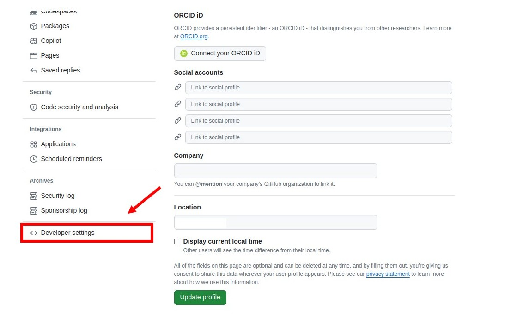
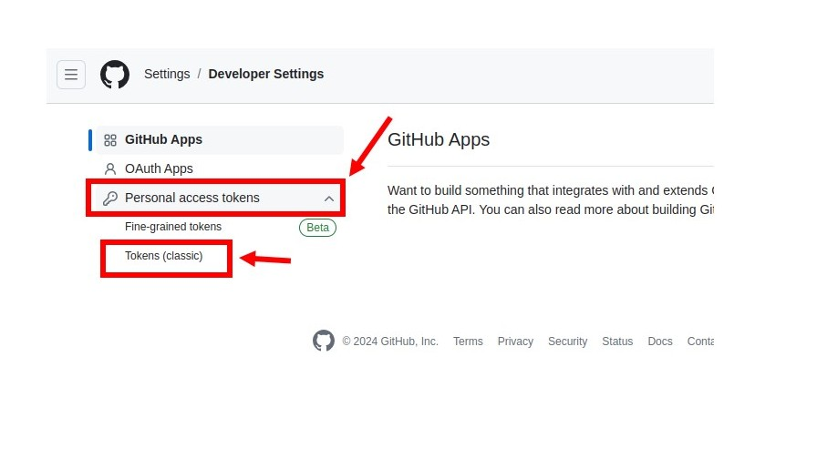
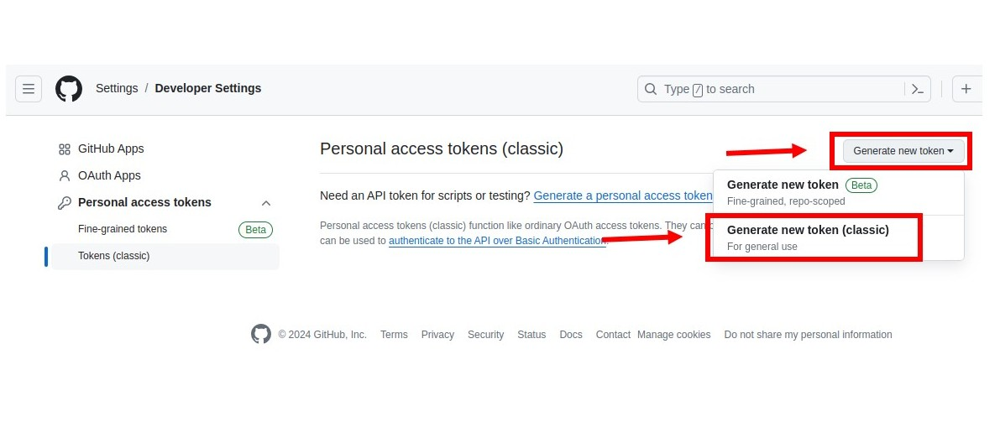
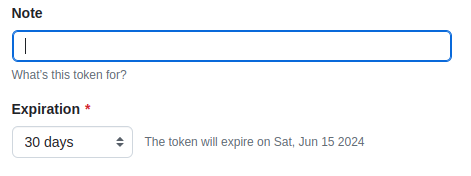
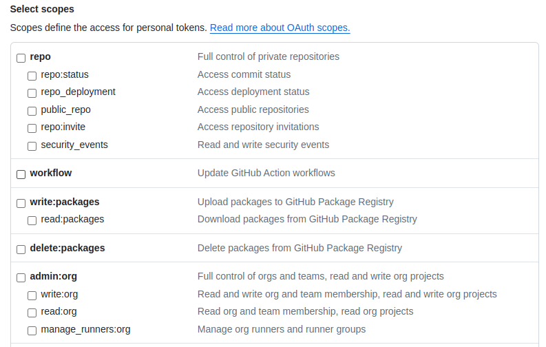
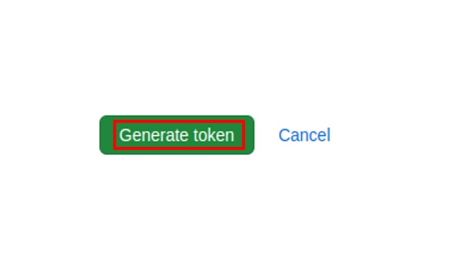

# Instruções Git
Um guia com instruções básicas do Git

## Índice
- [Como instalar o Git no Ubuntu](#como-instalar-o-git-no-ubuntu)
- [Configurações básicas do Git](#configurações-básicas-do-git)
- [Configurando a Autenticação do Git com Token no GitHub](#configurando-a-autenticação-do-git-com-token-no-gitHub)
- [Configurando a Autenticação do Git com uma Chave SSH no GitHub](#configurando-a-autenticação-do-git-com-uma-chave-ssh-no-gitHub)
______________________________________________________________________

## Como Instalar o Git no Ubuntu
1. Abra o terminal (Ctrl + Alt + T) e execute o comando abaixo, que irá adicionar o PPA do Git aos repositórios APT do seu sistema Ubuntu, permitindo que você instale o Git mais recente via gerenciador de pacotes:
```
sudo add-apt-repository ppa:git-core/ppa
```
2. Em seguida, para garantir que o sistema tenha acesso às versões mais recentes dos pacotes disponíveis, execute a linha de comando:
```
sudo apt update
```
3. Por fim, instale o Git em sua máquina:
```
sudo apt install git
```

## Configurações Básicas do Git
1. No terminal, execute o comando abaixo para configurar globalmente o nome de usuário:
```
git config --global user.name SEUNOMEAQUI
```
Isso é útil para garantir que os commits feitos em todos os seus repositórios Git usem o mesmo nome de usuário.

2. Você pode também configurar um e-mail:
```
git config --global user.email EMAIL@EMAIL.COM
```
Isso é útil para garantir que as contribuições e atividades sejam atribuídas corretamente a você nos repositórios Git.

3. Execute o comando abaixo para tornar a branch main como padrão:
```
git config --global init.defaultBranch main
```

## Configurando a Autenticação do Git com Token no GitHub
Para usar o Git e enviar suas alterações para o GitHub, é preciso se autenticar. Isso pode ser feito de duas maneiras: usando Tokens ou uma Chave SSH.
Os tokens são úteis porque podem guardar suas informações sem precisar salvar no servidor. Você pode configurá-los para ter as permissões que quiser e eles têm uma data de validade. Isso significa que param de funcionar depois de um tempo, como uma senha única que você usa só uma vez.

### Criando um Token
1. Faça login na sua conta [GitHub](https://github.com/)
2. Na página principal, selecione seu usuário no canto superior direito e clique na opção Settings:

3. Na página que irá abrir, clique na opção Developer settings:

4. Selecione a opção Personal access tokens > Tokens (classic):

5. Clique em Generate new token, escolha a opção Generate new token (classic):

6. Dê um nome para seu token e defina seu tempo de expiração:

7. Marque as permissões que você deseja conceder ao token. Detalhe, para usar seu token para acessar repositórios, selecione a opção repo.

8. Por fim, ao selecionar todas as opções escolhidas, clique em Generate token ao final da tela.

9. Prontinho, irá aparecer um código para que você possa usar como senha todas as vezes (até a data de expiração) que precisar realizar operações como git clone, git push, git pull.

### Editando a Credencial Git no Linux
Para não precisar copiar e colar o Token sempre que for realizar uma autenticação, o Git armazena temporariamente ou permanentemente suas credenciais (como nome de usuário e senha). Para isso, realize os seguintes passos:

1. Salve suas credenciais
- Use o seguinte comando para salvar temporariamente:
```
git config --global credential.helper cache
```
- Ou use o seguinte comando para salvar permanentemente:
```
git config --global credential.helper store
```
2. Realize uma operação que seja necessário uma autenticação com o GitHub:
- Você pode por exemplo criar um novo repositório privado em seu GitHub e tentar cloná-lo em sua máquina através do comando git clone
3. Pronto! A partir dos próximos comandos, o git não irá mais solicitar as credenciais.

## Configurando a Autenticação do Git com uma Chave SSH no GitHub
Uma Chave SSH é um par de chaves criptográficas: uma chave pública e uma chave privada. A chave pública é adicionada à sua conta do GitHub, enquanto a chave privada fica no seu computador. Quando você tenta acessar seu repositório, GitHub verifica a chave privada contra a chave pública para garantir que a conexão é segura e autorizada.

### No Linux
#### Gere uma nova Chave SSH
1. Abra o Terminal.
2. Cole o texto abaixo, substituindo o email usado no exemplo pelo seu endereço de email GitHub:
```
ssh-keygen -t ed25519 -C "your_email@example.com"
```
3. Quando for solicitado a inserir um arquivo para salvar a chave, pressione Enter para aceitar o local padrão do arquivo.
4. No prompt, você pode digitar uma frase secreta segura (opcional).

#### Adicione sua chave SSH ao ssh-agent
O SSH agent é um programa que mantém as chaves privadas em memória e facilita o uso dessas chaves para autenticação sem a necessidade de digitar a senha repetidamente.
1. Inicie o ssh-agent em segundo plano:
```
sudo eval "$(ssh-agent -s)"
```
2. Adicione sua chave SSH privada ao ssh-agent:
```
ssh-add ~/.ssh/id_ed25519
```
3. Adicione a chave pública SSH à sua conta em GitHub:
   - Use o comando abaixo para abrir o arquivo que contém a chave pública:
     ```
     cat ~/.ssh/id_ed25519.pub
     ```
   - Em seguida, selecione e copie a chave exibida no terminal.
   - Abra sua conta no [GitHub](https://github.com).
   - No canto superior direito de qualquer página, clique na foto do seu perfil e em Settings.
   - Na barra lateral, clique em  SSH and GPG Keys.
   - Clique em New SSH Key.
   - No campo "Title", adicione uma etiqueta descritiva para a nova chave. Por exemplo, se estiver usando um laptop pessoal, você poderá chamar essa chave de "Laptop pessoal".
   - Selecione o tipo de chave: Authentication Key.
   - No campo "Key", cole sua chave pública.
   - Clique em Add SSH Key.
   - Se solicitado, confirme acesso à sua conta em GitHub.
